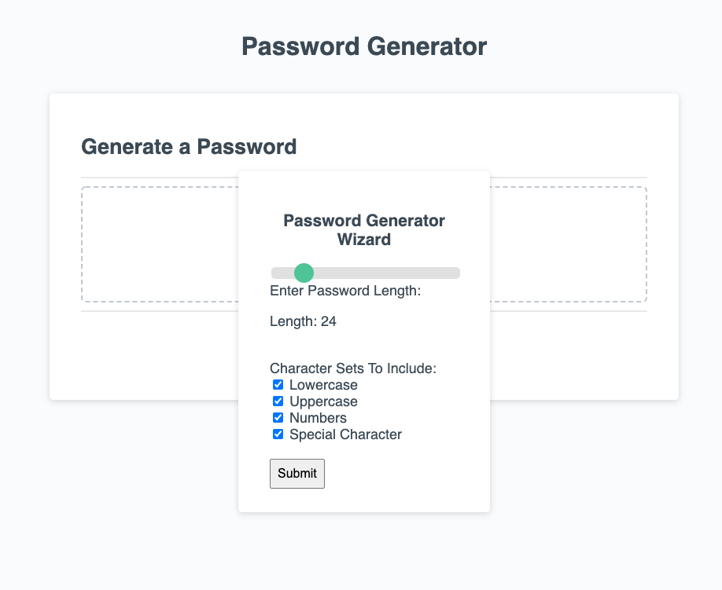
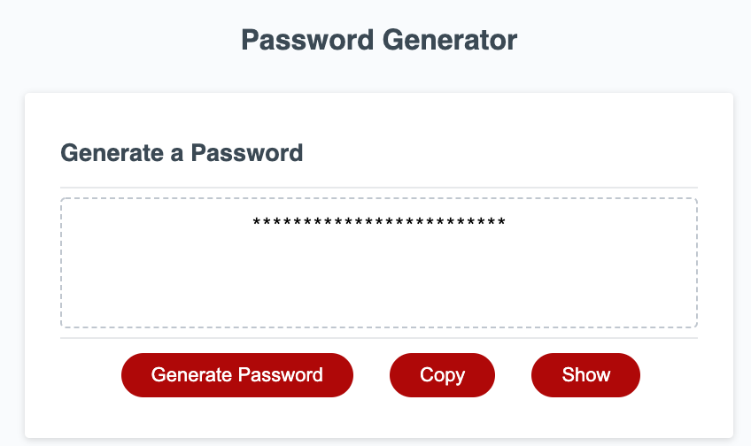

# DU-JavaScript-proj-3

This is a class project to code a basic password generator. 

### Criteria:

- User presented with a series of prompts for password criteria with length (8min to 128max) user confirms whether or not to include lowercase, uppercase, numeric, and/or special characters.

- Input should be validated and at least one character type should be selected

### Password Generator Application 

The application can be found hosted here: [Password Generator](https://anon123123123.github.io/du-javascript-proj-3/)

In addition to the basic requirements a custom prompt form was designed to obtain all password configuration without allowing improper types:

Furthermore the password is now hidden by default and the user can decide to show in the UI or copy the content:

